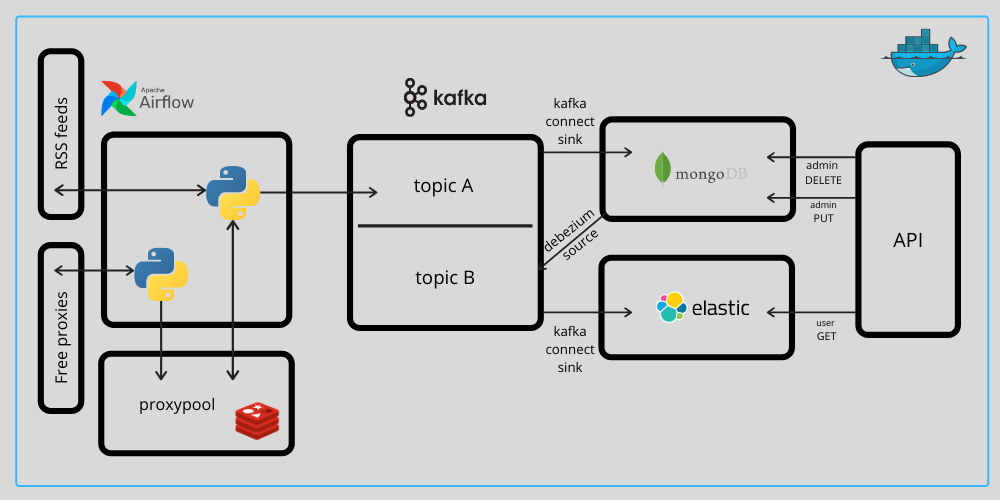

# DataEngineerWannabeProject

MVP - work in progress.

Check `develop` branch.




## Project setup

- Run services

```sh
docker-compose up -d
```

- Init Mongo replica set

```sh
docker exec mongo /usr/local/bin/init.sh
```

- Post Kafka Connectors

```sh
http POST localhost:8083/connectors @connect/mongo-sink.json
```

```sh
http POST localhost:8083/connectors @connect/mongo-dbz-source.json
```

```sh
http POST localhost:8083/connectors @connect/elasticsearch-sink.json
```

- Go to localhost:8080, turn on DAG `rss_news` and trigger it.

- And Voila! Check the latest news about your favourite team!

Example:
http://localhost:5000/v1/api/juventus
